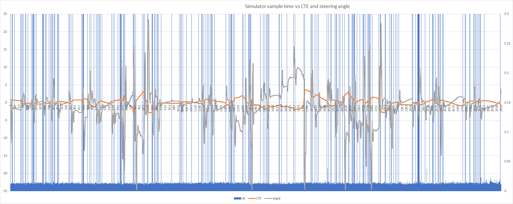

# CarND-Controls-PID

Self-Driving Car Engineer Nanodegree Program

---

## Compilation

The code compiles with `cmake` and `make`. (For dependencies and build instructions, see the original Udacity [`README.md`](https://github.com/udacity/CarND-PID-Control-Project/blob/master/README.md).)

## Implementation

The PID procedure follows what was taught in the lessons. The following paragraphs provide some detail of the implementation.

### The PID Class

The PID class (declared and defined int [`PID.h`](src/PID.h) and [`PID.cpp`](src/PID.cpp), respectively) encapsulates the essense of a PID controller. Any number of independently operating PID controller objects may be instantiated from the class. A PID object is initialized (at creation - see the constructor [`PID::PID()`](src/pid.cpp#L11) ) with the specified gain parameters (*Kp* , *Ki* , *Kd*) as well as the length for a running average filter and a value for the integrator limit (an anti-windup mechanism). The filter may be disabled by specifying a length of zero or one. The controller is updated by invoking [`PID::UpdateError()`](src/pid.cpp#L91) with the current error (the difference between the set point and the associated measurement of the plant output). The computed controller output is obtained by calling [`PID::ControlOutput()`](src/pid.cpp#L125).

The PID class incorporates support for auto-tuning using the so-called _Twiddle_ algorithm. The [`PID::TwiddleInit()`](src/pid.cpp#L31) function initializes relevant member variables and [`PID::TwiddleAdvance()`](src/pid.cpp#L49) is called after each _run_ of a specified number of simulation steps. The PID state can be (_should be!_ ) reset at the beginning of each twiddle run by calling [`PID::Reset()`](src/pid.cpp#L118).

### Twiddle Algorithm

The key to implementing the twiddle algorithm for this project was figuring out how to start a new _run_. This required some digging through the source code for the simulator which resulted in the discovery of a _reset_ message:

    std::string reset_msg = "42[\"reset\",{}]";

Since the _Twiddler_ is executed within the context of the simulation loop (rather than the other way around, as demonstrated in the classroom), the algorithm was refactored as a simple state machine that is initialized once then _advanced_ on each new _run_ (as defined by a predefined number of _steps_ through the simulation loop). The _Twiddler_, instead of synchronously executing a run, simply waits for the next run to be executed. The state machine keeps track of which parameter is being manipulated and has a state to indicate that a second run is needed to try subtracting the delta if the error failed to improve when adding the delta. Support for the twiddler algorithm was added directly to the PID class so that any instantiated PID controller can be "twiddled".

## Reflection

### The effects of the P, I, & D components

The proportional gain (_Kp_) governs the _intensity_ of a control's response to the error (i.e. the difference between the desired value and the actual measured value of the control variable). Finding an appropriate gain for steering (lane centering) is especially difficult: too little and the vehicle will drift off the road; too much and the vehicle over-reacts and begins to swerve from side to side uncontrollably. It is better to err on the side of less proportional gain to avoid introducing oscillation.

The integral gain (_Ki_) helps to keep the vehicle centered. When the vehicle begins to drift away from center &mdash; or is negotiating a curve &mdash; the error accumulates to create an output sufficient to steer the vehicle back toward center. The I-gain needs to be high enough to enable a quick response to a _disturbance_ (such as a sharp curve) but if it is too high, steering will be over-compensated, resulting in excessive oscillation.

Adding derivative gain (_Kd_) _slows down_ the response, in effect damping overshoot and oscillation caused by the relatively high I-gain needed to obtain a fast response. Excessive D-gain seems to make the steering response _jerky_ and may even contribute to overshoot.

### Choosing the hyperparameters

There are a total of four PID controllers: two for longitudinal control and two for lateral control.

For **lateral control**, an _outer_ PID loop sets the desired steering angle (in degrees) based on the cross track error (CTE). The output of this control is limited to the maximum capability of the car's steering (i.e. &plusmn; 25&deg;). An _inner_ loop commands the steering actuator based the difference between the set point and the sensed steering angle reported in the telemetry.

A similar configuration is used for **longitudinal control**. The outer loop sets the desired throttle position based on the difference between the set speed and the measured speed reported in the telemetry. The inner loop controls the throttle to the desired set point (output of the outer loop), based on the difference between the commanded set point and the throttle position reported in the telemetry.

### Tuning Procedure

During my initial experimentation, attempting to control the steering angle with a given (small) throttle value, I observed that the system is very sensitive to variation in speed. It is also difficult to correlate the throttle with a desired speed. So before attempting to tune the steering control, I created a PID speed controller. Looking at the sensor information provided in the telemetry (supplied by the simulator on each cycle), I noted that the actual throttle position is given along with the measured speed. I used the throttle information to create a smooth throttle controller.

#### Throttle Control

The throttle control was manually tuned using the following procedure:

Choose a throttle setpoint, creating a step input to the control. The goal is to tune the controller so the output is a critically damped response to the step input. A slightly underdamped response is acceptable (perhaps preferred). Set Ki and Kd to zero, then increase Kp until the ouput oscillates continuously - as close to stable as possible (the amplitude of the oscillation neither grows nor decays). Once this "ultimate" gain is determined, set  _Kp_ to half (or less) than the ultimate gain. Then increase  _Ki_ until the output achieves the setpoint value sufficiently quickly (just how quickly the control should respond is a subjective judgment). Finally, increase  _Kd_ to dampen the overshoot and oscillation induced by the increased integral gain.

#### Speed Control

Tuned similarly to the throttle control, except the Ziegler-Nichols method was used to determine the gains. As with manual tuning, first, the ultimate gain is determined. For Ziegler-Nichols, the oscillation period must be determined. Since this is a discrete time-sampled system, the period is measured in the number of sample periods between peaks (rather than in real-time seconds as would be the case for a continous control). This also assumes the sample period is reasonably regular.
From the ultimate gain *Ku* and the ocillation period *Tu* , the PID gains (for no overshoot) are computed as follows:  
*Kp* = *Ku* / 5  
*Ki* = (2/5) * *Ku* / *Tu*  
*Kd* = *Ku* * *Tu* / 15

In practice, I found it difficult to measure the oscillation period accurately, so the resulting response exhibits a small amount of overshoot.

> **Note:** The nominal simulation step period is 20 ms. Using `std::chrono::high_resolution_clock` to check the time between simulation cycles showed many longer cycles (about 300 ms) interspersed with seemingly random frequency. The graph below shows simulation cycle times superimposed on the cross-track error for a typical run (ending when the vehicle loses control and leaves the track). The effect of longer cycle can be seen as a discontinuity in the CTE measurement. This might just be a Windows-specific artifact - I was unable to test in any other environment.

After tuning the steering control well enough to get through the first curve, the speed control could be fine-tuned for better response at higher speeds using the Twiddle algorithm.

#### Steering Setpoint

The Steering Setpoint control was manually tuned in a manner similar to that for the throttle control. While this control may not be strictly necessary, the goal was to smooth out the steering response and, in general, make the steering more reliable and less susceptible to actuation and measurement noise.

#### Lane Centering (Steering) Control

The lane centering (steering) control was, _by far_, the most difficult to tune. It was possible to manually tune the steering control at a very low speed (e.g. with a constant throttle value of 0.2) such that the vehicle could navigate a single lap of the course _most_ times. But this manual tuning was not robust enough to guarantee a flawless lap _every_ time. Accepting the challenge of attempting higher speeds became the impetus for implementing the Twiddle algorithm. Still, finding _good enough_ values with which to seed the Twiddler was a tedious and frustrating exercise. After much trial and error and applying the twiddler at lower speeds, I attempted to use the Twiddle algorithm to tune the lane centering control at a speed of 27.5 mph, starting with the initial values of (_Kp_ , _Ki_ , _Kd_) = (1.925, 0.033, 58.0); and corresponding delta (_dp_) values (0.1, 0.001, 1). I let each _run_ execute 1500 simulation cycles &mdash; long enough for the vehicle to travel through the two sharpest curves. After XX iterations, the Twiddler arrived at the following gain values:  
| _Kp_ | _Ki_ | _Kp_ |
|:-:|:-:|:-:|
| 1.825 | 0.0336 | 59.05 |

## Simulation

The video below demonstrates the vehicle autonomously driving a lap around the track at 25 mph using manually-tuned PID gain parameters (_Kp_ ,  _Ki_ ,  _Kd_) = (1.925, 0.033, 58.0).

<figure class="video_container">
  <video width="640" height="480" controls="true" allowfullscreen="true"
          poster="video/27.5_mph_1.925_0.0326_59.05.png">
    <source src="video/27.5_mph_1.925_0.0326_59.05.mp4" type="video/mp4">
  </video>
</figure>
